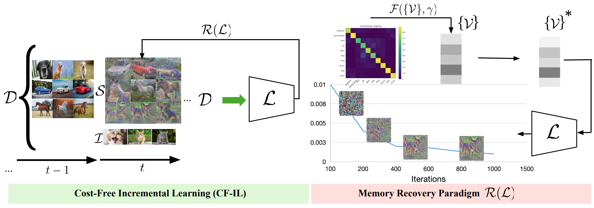

# Cost-Free-Incremental-Learning
This is the code for [Cost-Free-Incremental-Learning](https://openreview.net/forum?id=RxplU3vmBx) which is accepted on **ICLR 2022 Spotlight** paper.

[ Looking Back on Learned Experiences For Class/task Incremental Learning](https://openreview.net/forum?id=RxplU3vmBx)
## Abstract
Existing methods in IL tackle catastrophic forgetting by either storing old data samples or only updating a
parameter set of deep neural networks, which, however, demands a large memory
budget or spoils the flexibility of models to learn the incremented task distribution.
In this paper, we shed light on an on-call transfer set to provide past experiences
whenever a new task arises in the data stream. In particular, we propose a CostFree Incremental Learning (CF-IL) not only to replay past experiences the model
has learned but also to perform this in a cost free manner. Towards this end,
we introduced a memory recovery paradigm in which we query the network to
synthesize past exemplars whenever a new task emerges. Thus, our method needs
no extra memory for data buffering or network growing, besides calls the proposed
memory recovery paradigm to provide past exemplars, named a transfer set in
order to mitigate catastrophically forgetting the former tasks in the Incremental
Learning (IL) setup. Moreover, in contrast with recently proposed methods, the
suggested paradigm does not desire a parallel architecture since it only relies on
the learner network. Compared to the state-of-the-art data techniques without
buffering past data samples, CF-IL demonstrates significantly better performance
on the well-known datasets whether a task oracle is available in test time (Task-IL)
or not (Class-IL).




## Memory Recovery Paradimg (MRP)

To better understanding the MRP, we provide This [Notebook](MRP.ipynb) 
to visualize the process of recovering data from an arbitrary learner network. For the simplisity, we use one-hot vector instead of modeling the network output space using Dirichlet distribution. You can set `target_class` to an arbitrary class id to see the recovered sample.

To generate recovered samples :
`python run_MRP.py --dataset=[mnist, cifar10] --t_train=False --num_sample=4000 --batch_size=200 `

Recovered data for CIFAR-10 dataset and pretrained models are available [here](https://drive.google.com/drive/folders/1AR_tWxt36m9rm0SDHFIJ4LCjas9O3s-I?usp=sharing
).


## Citing
```BibTeX
@inproceedings{pourkeshavarzi2021looking,
  title={Looking Back on Learned Experiences For Class/task Incremental Learning},
  author={PourKeshavarzi, Mozhgan and Zhao, Guoying and Sabokrou, Mohammad},
  booktitle={International Conference on Learning Representations},
  year={2021}
}
```

### Reference
Our implementation references the codes in the following repositories:
* <https://github.com/aimagelab/mammoth>
* <https://github.com/da2so/Zero-shot_Knowledge_Distillation_Pytorch>
